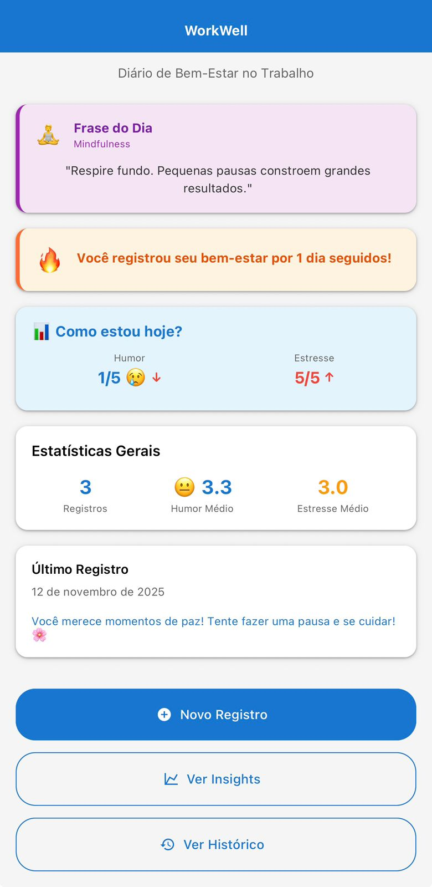
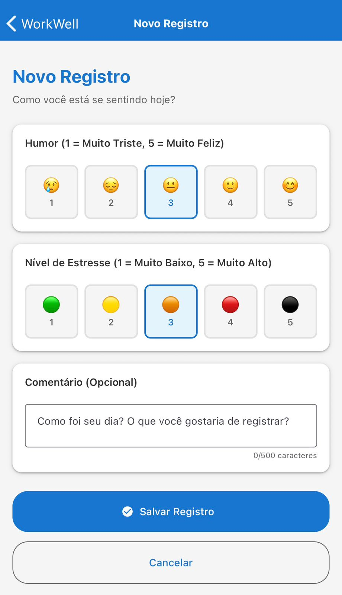
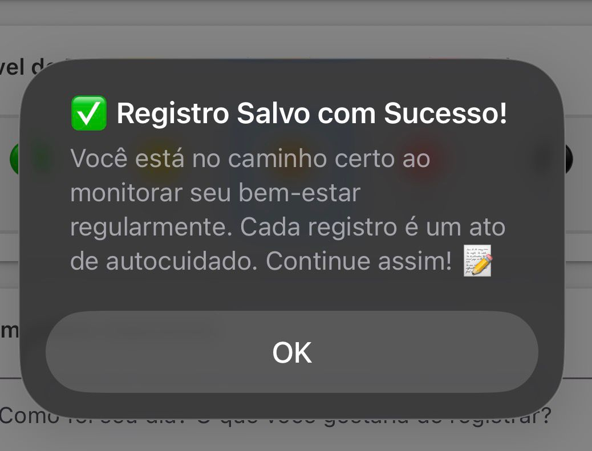
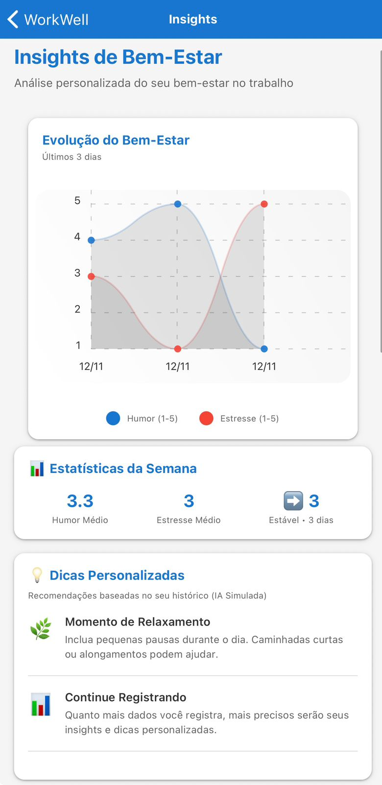
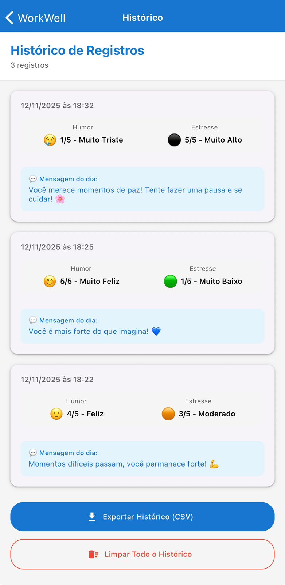

# Global Solution 2025 – Mobile Development & IoT

## WorkWell – Diário de Bem-Estar no Trabalho do Futuro

### Integrantes

- **Pedro Moura Barros** – RM550260
- **Rodrigo Fernandes dos Santos** – RM98896

---

## 📱 Sobre o Projeto

O **WorkWell** é um aplicativo móvel desenvolvido em React Native (Expo) que visa promover o bem-estar emocional e mental de profissionais no ambiente de trabalho. O aplicativo permite que os usuários registrem diariamente seu humor, nível de estresse e comentários sobre o dia, criando um diário pessoal digital que ajuda no autoconhecimento e na gestão do bem-estar.

### 🆕 Funcionalidades Inovadoras

O WorkWell utiliza **tecnologia de IA simulada** e recursos avançados para fornecer uma experiência completa de bem-estar:

- **🔥 Gamificação Real**: Sistema de streaks (dias consecutivos) e badges automáticas para motivar consistência
- **📊 Gráficos Interativos**: Visualização da evolução do humor e estresse com `react-native-chart-kit`
- **🤖 IA Humanizada**: Mensagens personalizadas e empáticas baseadas em análise contextual de padrões
- **💡 Insights Avançados**: Métricas semanais com comparações percentuais e tendências inteligentes
- **📈 Dashboard "Como estou hoje?"**: Painel interativo mostrando status atual com indicadores de tendência
- **🔄 Swipe to Delete**: Gestos intuitivos para gerenciar registros no histórico
- **🎨 Design Moderno**: Interface elegante e responsiva com feedback visual aprimorado
- **🔗 Conexão com o Futuro**: Visão conceitual de integração com IoT e saúde corporativa

### 🎯 Alinhamento com o Tema "O Futuro do Trabalho"

O projeto está totalmente alinhado ao tema da Global Solution FIAP 2025: **"O Futuro do Trabalho"**. O WorkWell demonstra como a tecnologia pode ser uma aliada na promoção de um ambiente de trabalho mais humano, saudável e equilibrado, focando em:

- **Saúde Mental**: Acompanhamento contínuo do bem-estar emocional
- **Autoconhecimento**: Identificação de padrões e tendências através do histórico
- **Prevenção**: Detecção precoce de sinais de estresse ou desgaste
- **Dignidade**: Respeito à privacidade com armazenamento local
- **Bem-estar**: Mensagens motivacionais que incentivam o cuidado pessoal
- **Gamificação**: Sistema de recompensas que motiva hábitos saudáveis
- **Empoderamento**: Dados e insights para tomada de decisão informada

O aplicativo representa uma visão de futuro onde a tecnologia não apenas aumenta a produtividade, mas também cuida da saúde e do bem-estar das pessoas, criando um ambiente de trabalho mais sustentável e humano.

### 🧭 Como o WorkWell Transforma o Futuro do Trabalho

O WorkWell demonstra como a tecnologia pode apoiar o bem-estar humano no trabalho do futuro, unindo IA, dados e design centrado no ser humano para promover equilíbrio e autoconsciência. Ao invés de monitorar trabalhadores, a tecnologia os empodera com dados e insights para que possam tomar decisões informadas sobre seu próprio bem-estar.

---

## 🚀 Instruções de Execução

### Pré-requisitos

Antes de começar, certifique-se de ter instalado:

- **Node.js** (versão 14 ou superior) - [Download aqui](https://nodejs.org/)
- **npm** (vem com o Node.js)
- **Expo Go** instalado no seu dispositivo móvel:
  - [Android - Google Play Store](https://play.google.com/store/apps/details?id=host.exp.exponent)
  - [iOS - App Store](https://apps.apple.com/app/expo-go/id982107779)

### 📋 Passo a Passo Completo

#### 1. Abrir o Projeto no VS Code

1. Abra o **Visual Studio Code**
2. Vá em `File > Open Folder...` (ou `Ctrl+K Ctrl+O`)
3. Selecione a pasta `GS-MOBILEE` do projeto
4. Aguarde o VS Code carregar o projeto

#### 2. Abrir o Terminal no VS Code

Você pode abrir o terminal de duas formas:

- **Método 1**: Pressione `` Ctrl + ` `` (Ctrl + crase)
- **Método 2**: Vá em `Terminal > New Terminal` no menu superior

#### 3. Instalar as Dependências

No terminal do VS Code, execute:

```bash
npm install
```

**⏱️ Tempo estimado**: 1-3 minutos

**✅ Você saberá que funcionou quando ver**: 
```
added XXX packages, and audited XXX packages
found 0 vulnerabilities
```

#### 4. Iniciar o Servidor de Desenvolvimento

Ainda no terminal do VS Code, execute:

```bash
npm start
```

**Ou, para limpar o cache (recomendado na primeira vez):**

```bash
npx expo start --clear
```

**⏱️ Aguarde**: O servidor levará alguns segundos para iniciar

**✅ Você verá**:
- Um QR Code no terminal
- Mensagem: `Metro waiting on exp://...`
- Opções de comando disponíveis

#### 5. Conectar seu Dispositivo

**Opção A - Dispositivo Físico (Recomendado):**

1. **Android**:
   - Abra o app **Expo Go** no seu celular
   - Toque em **"Scan QR Code"**
   - Escaneie o QR Code que aparece no terminal do VS Code
   - Aguarde o app carregar

2. **iOS**:
   - Abra o app **Câmera** do iPhone
   - Aponte para o QR Code no terminal
   - Toque na notificação que aparecer
   - O Expo Go abrirá automaticamente

**Opção B - Emulador/Simulador:**

No terminal onde o servidor está rodando, pressione:
- `a` - Para abrir no emulador Android (se tiver instalado)
- `i` - Para abrir no simulador iOS (apenas no macOS)
- `w` - Para abrir no navegador web

**Opção C - Comandos Diretos:**

Você também pode usar comandos específicos em um novo terminal:

```bash
# Para Android
npm run android

# Para iOS (apenas macOS)
npm run ios

# Para Web
npm run web
```

### 🔧 Solução de Problemas Comuns

#### Erro: "Cannot find module"
```bash
# Limpe o cache e reinstale
npm cache clean --force
rm -rf node_modules
npm install
```

#### Erro: "Port already in use"
```bash
# Use uma porta diferente
npx expo start --port 8082
```

#### QR Code não aparece
- Certifique-se de que o terminal está mostrando o output completo
- Tente pressionar `r` para recarregar
- Feche e abra um novo terminal

#### App não carrega no dispositivo
- Verifique se o celular e computador estão na **mesma rede Wi-Fi**
- Tente usar o modo **Tunnel** (pressione `s` no terminal e escolha "Tunnel")
- Reinicie o servidor com `npm start`

#### Erro de SDK incompatível
O projeto está configurado para **Expo SDK 54**. Certifique-se de ter a versão mais recente do Expo Go instalada.

### 📱 Testando o Aplicativo

Após o app abrir no seu dispositivo:

1. **Tela Home**: Você verá a tela inicial com opções
2. **Criar Registro**: Toque em "Novo Registro" e preencha os campos
3. **Ver Histórico**: Toque em "Ver Histórico" para ver seus registros salvos

### 🛑 Parar o Servidor

Para parar o servidor, pressione `Ctrl + C` no terminal.

### Estrutura do Projeto

```
GS-MOBILEE/
├── App.js                      # Componente principal com navegação
├── package.json                # Dependências do projeto
├── app.json                    # Configurações do Expo
├── babel.config.js             # Configuração do Babel
├── README.md                   # Este arquivo
│
├── src/
│   ├── screens/
│   │   ├── HomeScreen.js       # Tela inicial com resumo e estatísticas
│   │   ├── NewEntryScreen.js   # Tela para criar novo registro
│   │   ├── HistoryScreen.js    # Tela com histórico de registros
│   │   └── InsightsScreen.js   # Tela de insights com gráficos e dicas (IA)
│   │
│   ├── components/
│   │   ├── EntryCard.js        # Componente de card para exibir registros
│   │   └── MoodStressChart.js  # Componente de gráfico de evolução
│   │
│   ├── services/
│   │   └── storage.js          # Serviço de persistência com AsyncStorage
│   │
│   ├── utils/
│   │   └── motivationalMessages.js  # Sistema de IA simulada para mensagens personalizadas
│   │
│   └── theme/
│       └── theme.js            # Tema personalizado do React Native Paper
│
└── assets/                     # Imagens e ícones (opcional)
```

---

## 💾 AsyncStorage

O aplicativo utiliza o **AsyncStorage** para armazenar e recuperar os registros localmente no dispositivo. Isso garante:

- **Persistência**: Os dados permanecem salvos mesmo após fechar o aplicativo
- **Privacidade**: Todos os dados ficam armazenados apenas no dispositivo do usuário
- **Performance**: Acesso rápido aos dados sem necessidade de conexão com internet
- **Offline**: Funcionamento completo sem necessidade de conexão

### Como Funciona

- **Salvar**: Cada novo registro é adicionado ao array de registros e salvo no AsyncStorage
- **Recuperar**: Ao abrir o aplicativo, todos os registros são carregados automaticamente
- **Persistência**: Os dados são armazenados em formato JSON e mantidos entre sessões

---

## 📱 Como Funciona

### Tela Home (HomeScreen)

A tela inicial exibe:

- **Boas-vindas**: Mensagem de apresentação para novos usuários
- **Estatísticas Gerais**: 
  - Total de registros
  - Média de humor (com emoji representativo)
  - Média de estresse (com cor indicativa)
- **Último Registro**: Data e mensagem motivacional do registro mais recente
- **🔥 Gamificação**:
  - Card de streak mostrando dias consecutivos de registros
  - Badges automáticas desbloqueadas ao atingir marcos (7, 15, 30 dias, etc.)
  - Recorde pessoal de maior streak
  
- **📊 Dashboard "Como estou hoje?"**:
  - Exibido quando o usuário já registrou hoje
  - Mostra humor e estresse do dia atual
  - Indicadores de tendência (↑ melhorando, ↓ piorando, → estável)
  - Sugestão rápida da IA baseada no equilíbrio atual
  
- **Ações Rápidas**:
  - Botão "Novo Registro" para criar uma nova entrada
  - Botão "Ver Insights" (aparece quando há registros) - Análise inteligente com gráficos
  - Botão "Ver Histórico" (aparece quando há registros)

### Tela Novo Registro (NewEntryScreen)

Permite criar um novo registro com:

- **Humor**: Escala de 1 a 5 (1 = Muito Triste, 5 = Muito Feliz)
  - Seleção através de botões segmentados com emojis
- **Nível de Estresse**: Escala de 1 a 5 (1 = Muito Baixo, 5 = Muito Alto)
  - Seleção através de botões segmentados com cores
- **Comentário**: Campo de texto opcional (até 500 caracteres)
  - Permite descrever o dia ou adicionar observações

Ao salvar:
- O registro é armazenado no AsyncStorage
- **IA Simulada**: O sistema analisa o histórico do usuário (médias de humor e estresse)
- Uma **mensagem motivacional personalizada** é gerada baseada no contexto atual
- A mensagem considera:
  - Médias históricas de humor e estresse
  - Valores do registro atual
  - Padrões detectados (ex: estresse alto, humor baixo)
- Um alerta de sucesso é exibido com a mensagem personalizada
- O usuário é redirecionado para a tela Home

### Tela Histórico (HistoryScreen)

Exibe todos os registros salvos em ordem cronológica (mais recentes primeiro):

- **Cabeçalho**: Título e contador de registros
- **Lista de Registros**: Cada registro é exibido em um card contendo:
  - Data e hora do registro
  - Humor (emoji + valor numérico + descrição)
  - Nível de estresse (emoji + valor numérico + descrição)
  - Comentário (se houver)
  - Mensagem motivacional do dia
- **🔄 Swipe to Delete**: 
  - Deslize um registro para a esquerda para ver opção de deletar
  - Confirmação antes de deletar
  - Animação suave durante o swipe
- **Ações**:
  - Pull-to-refresh para atualizar a lista
  - Botão "Limpar Todo o Histórico" (com confirmação)

### Tela Insights (InsightsScreen) 🆕

Nova tela que demonstra o poder da tecnologia no bem-estar:

- **📊 Gráfico de Evolução**: 
  - Visualização interativa dos últimos 7 dias
  - Linhas separadas para humor (azul) e estresse (vermelho)
  - Permite identificar tendências e padrões visuais
  
- **📈 Estatísticas Semanais Avançadas**:
  - Média de humor da última semana
  - Média de estresse da última semana
  - Total de registros na semana
  - Indicador de tendência (Melhorando 📈, Estável ➡️, Atenção 📉)
  - **Mudanças Percentuais**: Comparação com a semana anterior
    - "Seu humor melhorou 12% esta semana — continue assim!"
    - "Seu estresse diminuiu 8% — ótimo progresso!"
  - Mensagens automáticas baseadas nas métricas
  
- **💡 Dicas Personalizadas (IA Simulada)**:
  - Análise automática do histórico do usuário
  - Dicas contextuais baseadas em:
    - Níveis de estresse detectados
    - Padrões de humor
    - Comparação entre dias da semana vs. finais de semana
    - Duração do histórico de registros
  - Cada dica inclui ícone, título e descrição personalizada
  
- **🔗 Conexão com o Futuro**:
  - Seção informativa sobre integração com IoT e saúde corporativa
  - Visão de conexão com smartwatches e wearables
  - Integração conceitual com softwares corporativos de saúde mental
  - Plataformas de RH humanizadas
  - Alinhamento com ODS 3 e 8
  
- **🤖 Explicação sobre IA Simulada**:
  - Card informativo explicando como a tecnologia funciona
  - Demonstra como IA pode ajudar no futuro do trabalho

### Componente EntryCard

Componente reutilizável que exibe um registro individual:

- Formatação automática de data e hora
- Emojis visuais para humor e estresse
- Layout responsivo e moderno
- Destaque para mensagem motivacional

### Componente MoodStressChart 🆕

Componente de gráfico interativo:

- Utiliza `react-native-chart-kit` para visualização
- Exibe evolução do humor e estresse
- Suporta até 7 dias de histórico
- Design responsivo e moderno
- Legenda explicativa

---

## 🤖 Sistema de IA Simulada

O WorkWell implementa um **sistema de IA simulada** que demonstra como a tecnologia pode ser usada para promover bem-estar no trabalho do futuro.

### Como Funciona

1. **Análise de Dados**:
   - Coleta e processa dados históricos do usuário
   - Calcula médias, tendências e padrões
   - Identifica correlações entre humor e estresse

2. **Geração de Insights**:
   - **Mensagens Personalizadas**: Analisa o contexto atual e histórico para fornecer feedback relevante
   - **Dicas de Bem-Estar**: Gera recomendações baseadas em padrões detectados
   - **Detecção de Tendências**: Identifica se o bem-estar está melhorando, piorando ou estável

3. **Categorização Inteligente**:
   - **Excelente**: Alto humor, baixo estresse → Mensagens de manutenção
   - **Bom**: Humor positivo, estresse moderado → Mensagens de continuidade
   - **Moderado**: Valores médios → Mensagens de autoconhecimento
   - **Atenção**: Humor baixo ou estresse alto → Mensagens de cuidado
   - **Alto Estresse**: Estresse muito elevado → Alertas e recomendações urgentes

### Impacto no Bem-Estar do Trabalhador do Futuro

- **Prevenção Proativa**: Detecta sinais de desgaste antes que se tornem problemas maiores
- **Autoconhecimento**: Ajuda o usuário a entender seus próprios padrões
- **Feedback Contextualizado**: Mensagens relevantes ao momento atual do usuário
- **Visualização de Dados**: Gráficos facilitam a compreensão de tendências
- **Empoderamento**: Dá ao trabalhador ferramentas para gerenciar seu próprio bem-estar

### Tecnologia Utilizada

- **Análise de Padrões**: Algoritmos simples que identificam tendências
- **Categorização Contextual**: Sistema de regras baseado em thresholds
- **Visualização de Dados**: Gráficos interativos para melhor compreensão
- **Personalização**: Adaptação das mensagens ao perfil do usuário

---

## 🎨 Design e Tecnologias

### Design

- **Moderno e Limpo**: Interface minimalista focada na usabilidade
- **Responsivo**: Adapta-se a diferentes tamanhos de tela
- **Acessível**: Cores contrastantes e textos legíveis
- **Intuitivo**: Navegação simples e clara

### Tecnologias Utilizadas

- **React Native**: Framework para desenvolvimento mobile
- **Expo**: Plataforma e ferramentas para desenvolvimento React Native
- **React Navigation**: Navegação entre telas (Stack Navigator)
- **React Native Paper**: Biblioteca de componentes Material Design
- **AsyncStorage**: Persistência local de dados
- **React Native Chart Kit**: Biblioteca para visualização de gráficos
- **React Native SVG**: Suporte para gráficos vetoriais
- **React Hooks**: useState, useEffect para gerenciamento de estado
- **IA Simulada**: Sistema de análise e personalização baseado em padrões

---

## 🏆 Destaques Técnicos

O WorkWell implementa recursos avançados que demonstram o potencial da tecnologia mobile:

- ✅ **Persistência Local com AsyncStorage**: Dados seguros e privados no dispositivo
- ✅ **IA Simulada Contextual e Empática**: Análise inteligente com linguagem humanizada
- ✅ **Gráficos Interativos**: Visualização de evolução com `react-native-chart-kit`
- ✅ **Tendências Inteligentes**: Comparações percentuais e detecção automática de padrões
- ✅ **Sistema de Gamificação**: Streaks (dias consecutivos) e badges automáticas
- ✅ **Tema Dinâmico**: Suporte para modo claro/escuro (preparado para expansão)
- ✅ **Interface Animada**: Feedback visual e animações suaves
- ✅ **Funcionalidades Modernas**: Swipe to delete, pull-to-refresh, dashboard interativo
- ✅ **Conexão Conceitual com IoT**: Visão de integração com wearables e saúde corporativa
- ✅ **Design Futurista**: Interface elegante, responsiva e centrada no usuário

---

## 🔮 Possíveis Melhorias Futuras

### Funcionalidades Avançadas

1. **Sincronização com Nuvem**
   - Backup automático dos dados
   - Sincronização entre múltiplos dispositivos
   - Recuperação de dados em caso de perda do dispositivo

2. **Integração Real com IA de Saúde Mental**
   - Análise mais profunda usando modelos de machine learning
   - Recomendações baseadas em evidências científicas
   - Alertas proativos com escalação para profissionais quando necessário

3. **Análises Avançadas**
   - Gráficos mensais e anuais
   - Identificação de padrões sazonais
   - Relatórios exportáveis em PDF
   - Correlação com eventos do calendário

4. **Lembretes e Notificações Inteligentes**
   - Notificações adaptativas baseadas em padrões
   - Lembretes de pausas baseados em níveis de estresse
   - Mensagens motivacionais no momento certo

5. **Personalização Avançada**
   - Modo escuro completo (já preparado na estrutura)
   - Temas customizáveis
   - Personalização de mensagens motivacionais
   - Configurações granulares de privacidade

6. **Integração Real com Wearables**
   - Sincronização com Apple Health, Google Fit
   - Dados reais de frequência cardíaca e sono
   - Correlação entre dados físicos e emocionais
   - Detecção de estresse através de sinais fisiológicos

7. **Recursos de Mindfulness Integrados**
   - Exercícios de respiração guiados com timer
   - Meditações curtas (5-10 minutos)
   - Técnicas de relaxamento progressivo
   - Integração com apps de meditação

8. **Modo Corporativo**
   - Dashboard anônimo para gestores de RH
   - Identificação de tendências gerais sem expor dados individuais
   - Sugestões de melhorias no ambiente de trabalho
   - Integração com programas de EAP (Employee Assistance Program)

---

## 🎥 Vídeos de Demonstração

### Vídeo "Plus" (Demonstração do Aplicativo)

Vídeo de demonstração completo do WorkWell, mostrando todas as funcionalidades principais do aplicativo, incluindo:

- Criação de novos registros
- Visualização do histórico
- Sistema de gamificação (streaks e badges)
- Tela de insights com gráficos
- Persistência de dados com AsyncStorage (demonstração de fechar e abrir o app)
- Exportação de CSV

**Duração**: Até 5 minutos  
**Link**: [Assistir no YouTube](https://youtu.be/vU4tCsnxu90)

---

## 📸 Capturas de Tela

### Tela Home
A tela inicial do WorkWell mostra um resumo completo do bem-estar do usuário, incluindo estatísticas gerais, streak de dias consecutivos, badges desbloqueadas e o dashboard "Como estou hoje?".



### Tela de Novo Registro
Interface intuitiva para registrar o humor, nível de estresse e comentários sobre o dia de trabalho.



**Alerta de Sucesso**: Após salvar um registro, o aplicativo exibe um alerta com uma mensagem motivacional personalizada gerada pela IA simulada, baseada no histórico e no contexto atual do usuário.



### Tela de Insights
Análise avançada com gráficos interativos, estatísticas semanais, comparações percentuais e dicas personalizadas baseadas em IA simulada.



### Tela de Histórico
Visualização completa de todos os registros salvos, com opção de exportar para CSV e gerenciar registros individuais.



---

## 📝 Notas de Desenvolvimento

### Decisões Técnicas

- **AsyncStorage**: Escolhido por ser nativo, simples e adequado para dados não sensíveis, garantindo privacidade
- **React Native Paper**: Escolhido por oferecer componentes Material Design prontos, bem documentados e acessíveis
- **Stack Navigator**: Escolhido por ser adequado para navegação hierárquica simples e intuitiva
- **React Native Chart Kit**: Escolhido por ser leve, performático e fácil de integrar
- **React Native Gesture Handler**: Escolhido para gestos nativos como swipe to delete
- **Hooks**: Utilizados para gerenciamento de estado local e efeitos colaterais
- **IA Simulada**: Implementada com análise contextual e linguagem natural para demonstrar potencial

### Arquitetura

- **Separação de Responsabilidades**: Serviços (storage, gamification), componentes reutilizáveis, telas focadas
- **Estado Local**: Gerenciamento eficiente com hooks e AsyncStorage
- **Performance**: Otimizações com memoização e lazy loading quando necessário
- **Acessibilidade**: Componentes com suporte a leitores de tela e contraste adequado

### Limitações Conhecidas

- Dados armazenados apenas localmente (sem backup automático na nuvem)
- Sem sincronização entre dispositivos (funcionalidade futura)
- IA simulada (não utiliza modelos de machine learning reais, mas demonstra conceito)
- Modo escuro preparado mas não totalmente implementado (estrutura pronta)

---

## 📄 Licença

Este projeto foi desenvolvido para a Global Solution FIAP 2025 como parte do curso de Mobile Development & IoT.

---

## 👥 Contato

Para dúvidas ou sugestões sobre o projeto:

- **Pedro Moura Barros** – RM550260
- **Rodrigo Fernandes dos Santos** – RM98896

---

## 🎓 Agradecimentos

Agradecemos à FIAP pela oportunidade de desenvolver este projeto e contribuir para a discussão sobre o futuro do trabalho, demonstrando como a tecnologia pode ser uma ferramenta de bem-estar e humanização no ambiente profissional.

---

**Desenvolvido com ❤️ para o futuro do trabalho**

